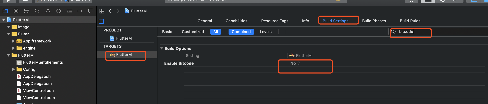
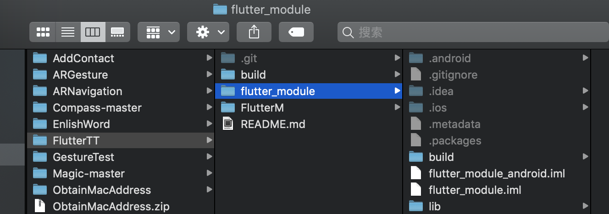
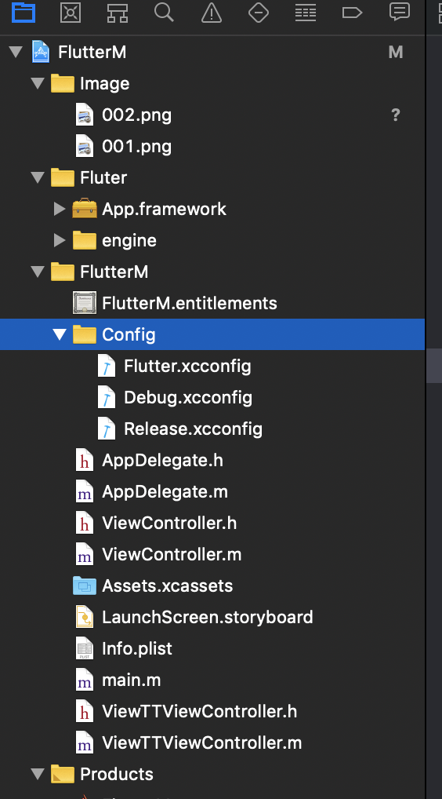
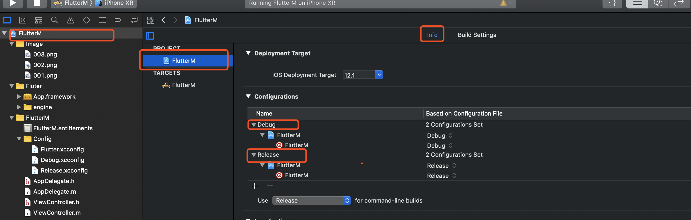
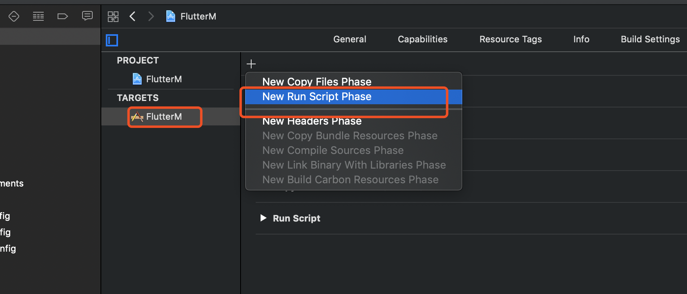
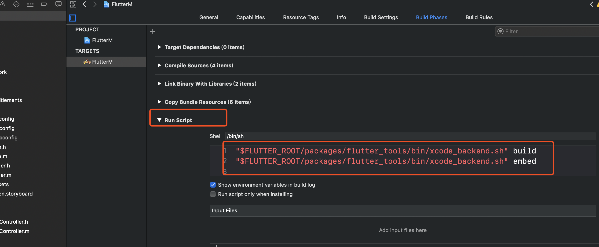
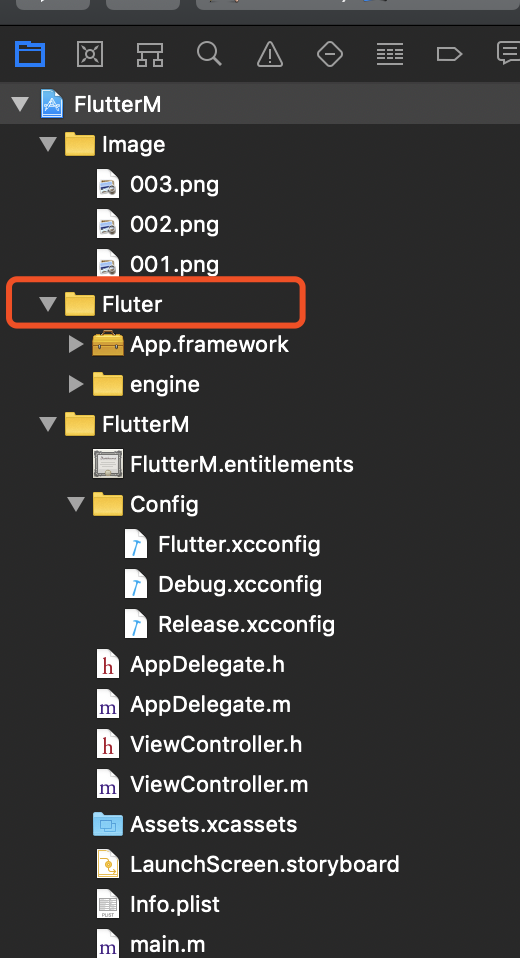

# iOSFlutter
iOS项目集成Flutter

1. Flutter环境安装，请参考官方文档 https://flutter.dev/docs/development/tools/sdk/archive#macos
2. 确保环境正确 
  终端输入
  
   ``` 
   flutter doctor -v  
   ```
  输出项均正确
  
  ```
  [✓] Flutter (Channel master, v1.3.4-pre.11, on Mac OS X 10.14.3 18D109, locale zh-Hans-CN)
    • Flutter version 1.3.4-pre.11 at /Users/zhangxiaosong/Documents/soft/flutterV
    • Framework revision 5099701f88 (13 days ago), 2019-03-04 14:26:50 -0800
    • Engine revision 4f54a1dd94
    • Dart version 2.2.1 (build 2.2.1-dev.0.0 7c70ab1817)

[✓] Android toolchain - develop for Android devices (Android SDK version 28.0.3)
    • Android SDK at /Users/zhangxiaosong/Library/Android/sdk
    • Android NDK location not configured (optional; useful for native profiling support)
    • Platform android-28, build-tools 28.0.3
    • Java binary at: /Applications/Android Studio.app/Contents/jre/jdk/Contents/Home/bin/java
    • Java version OpenJDK Runtime Environment (build 1.8.0_152-release-1248-b01)
    • All Android licenses accepted.

[✓] iOS toolchain - develop for iOS devices (Xcode 10.1)
    • Xcode at /Applications/Xcode.app/Contents/Developer
    • Xcode 10.1, Build version 10B61
    • ios-deploy 1.9.4
    • CocoaPods version 1.6.0.beta.2

[✓] Android Studio (version 3.3)
    • Android Studio at /Applications/Android Studio.app/Contents
    • Flutter plugin version 33.3.1
    • Dart plugin version 182.5215
    • Java version OpenJDK Runtime Environment (build 1.8.0_152-release-1248-b01)

[✓] IntelliJ IDEA Ultimate Edition (version 2018.2.4)
    • IntelliJ at /Applications/IntelliJ IDEA.app
    • Flutter plugin version 31.3.3
    • Dart plugin version 182.5215

[✓] Connected device (1 available)
    • iPhone XR • A6DB891B-F31A-42ED-A6AD-2E67F3511251 • ios • iOS 12.1 (simulator)

• No issues found!
  ```
  
  3. iOS项目设置EnableBitCode 为NO
  
     
       
  4. Flutter Module创建
    拉取新代码
    
   ```
   bogon:flutterV zxs$ git pull         
  ```
    
    创建
    进入项目路径，并执行
    
   ``` 
   flutter create -t module flutter_module 
   ```
    会在目录中生成flutter_module文件
    
   
   
  5. 创建iOS项目的Config文件里面分别创建 Flutter.xcconfig Debug.xcconfig  Release.xcconfig 。其中 Flutter.xcconfig是指向外目录flutter_module的Generated.xcconfig 文件路径引用文件，其他两个代表xcode的配置文件
  
        
    
      使用了 cocoapods 在Debug和Release中添加
      
      ```  
      #include "Pods/Target Support Files/Pods-FlutterMixed/Pods-FlutterMixed.debug.xcconfig"
      
      #include "Pods/Target Support Files/Pods-FlutterMixed/Pods-FlutterMixed.release.xcconfig" 
           
       ```
           
       Flutter.xcconfig
       
       ```  
       #include "flutter_module/.ios/Flutter/Generated.xcconfig" 
       ENABLE_BITCODE = NO
        
       ```
       
       Debug.xcconfig
       
        ```
        #include "Flutter.xcconfig"
       ```
       
       Release.xcconfig
       
       ```
       #include "Flutter.xcconfig"
       FLUTTER_BUILD_MODE=release
       ```
       
  6.  Xcode project环境配置
  
      
     
  7. 添加脚本
  
     
     
     
        
     ``` 
     "$FLUTTER_ROOT/packages/flutter_tools/bin/xcode_backend.sh" build
     "$FLUTTER_ROOT/packages/flutter_tools/bin/xcode_backend.sh" embed
     ```
     
     注意： Run Script 在Target Dependencies或者[CP]Check pods Manifest.lock后面
       
  8. 添加好之后Build或Run后，会在iOS工程文件夹中生成一个Flutter文件（我是没生成成功，只能手动添加
     【在工程文件下手动创建一个Flutter文件夹，把flutter_moduler=>.ios=>
     Flutter文件中的App.framework engine文件添加到里面】）
     
       
       
  9. 将flutter_module=>lib=>main.dart中的代码替换如下
  
  ```
  
  import 'package:flutter/material.dart';
  import 'package:flutter/services.dart';
  
  void main() => runApp(MyApp());
  
  class MyApp extends StatelessWidget {
    // This widget is the root of your application.
    @override
    Widget build(BuildContext context) {
      return MaterialApp(
        title: 'Flutter Demo',
        theme: ThemeData(
          // This is the theme of your application.
          //
          // Try running your application with "flutter run". You'll see the
          // application has a blue toolbar. Then, without quitting the app, try
          // changing the primarySwatch below to Colors.green and then invoke
          // "hot reload" (press "r" in the console where you ran "flutter run",
          // or press Run > Flutter Hot Reload in a Flutter IDE). Notice that the
          // counter didn't reset back to zero; the application is not restarted.
          primarySwatch: Colors.blue,
        ),
        home: MyHomePage(title: 'Flutter Demo Home Page'),
      );
    }
  }
  
  class MyHomePage extends StatefulWidget {
    MyHomePage({Key key, this.title}) : super(key: key);
  
    // This widget is the home page of your application. It is stateful, meaning
    // that it has a State object (defined below) that contains fields that affect
    // how it looks.
  
    // This class is the configuration for the state. It holds the values (in this
    // case the title) provided by the parent (in this case the App widget) and
    // used by the build method of the State. Fields in a Widget subclass are
    // always marked "final".
  
    final String title;
  
    @override
    _MyHomePageState createState() => _MyHomePageState();
  }
  
  class _MyHomePageState extends State<MyHomePage> {
  
    // 创建一个给native的channel (类似iOS的通知）
    static const methodChannel = const MethodChannel('com.pages.your/native_get');
  
    int _counter = 0;
  
    void _incrementCounter() {
      setState(() {
        _counter++;
  
        print('flutter的log打印：现在输出count=$_counter');
        // 当个数累积到3的时候给客户端发参数
        if(_counter == 3) {
          _toNativeSomethingAndGetInfo();
        }
  
        // 当个数累积到5的时候给客户端发参数
        if(_counter == 1002) {
          Map<String, String> map = { "title": "这是一条来自flutter的参数" };
          methodChannel.invokeMethod('toNativePush',map);
        }
  
        // 当个数累积到8的时候给客户端发参数
        if(_counter == 1005) {
          Map<String, dynamic> map = { "content": "flutterPop回来","data":[1,2,3,4,5]};
          methodChannel.invokeMethod('toNativePop',map);
        }
      });
    }
  
    // 给客户端发送一些东东 , 并且拿到一些东东
    Future<Null> _toNativeSomethingAndGetInfo() async {
      dynamic result;
      try {
        result = await methodChannel.invokeMethod('toNativeSomething','大佬你点击了$_counter下');
      } on PlatformException {
        result = 100000;
      }
      setState(() {
        // 类型判断
        if (result is int) {
          _counter = result;
        }
      });
    }
  
    @override
    Widget build(BuildContext context) {
  
      return new Scaffold(
  //      appBar: new AppBar(
  //        // Here we take the value from the MyHomePage object that was created by
  //        // the App.build method, and use it to set our appbar title.
  //        title: new Text(widget.title),
  //      ),
        body: new Center(
          child: new Column(
            mainAxisAlignment: MainAxisAlignment.center,
            children: <Widget>[
              new Text(
                'he button this many times:',
              ),
              new Text(
                '$_counter',
                style: Theme.of(context).textTheme.display1,
              ),
            ],
          ),
        ),
        floatingActionButton: new FloatingActionButton(
          onPressed: _incrementCounter,
          tooltip: 'Increment',
          child: new Icon(Icons.add),
        ), // This trailing comma makes auto-formatting nicer for build methods.
      );
    }
  }
  

  ```
  
  ViewController.m
  
  ```
  
  - (void)viewDidLoad {
      [super viewDidLoad];
      // Do any additional setup after loading the view, typically from a nib.
      
      
      UIButton *btn = [[UIButton alloc] init];
      [self.view addSubview:btn];
      [btn setTitle:@"NEXT" forState:UIControlStateNormal];
      [btn setTitleColor:UIColor.blackColor forState:UIControlStateNormal];
      [btn setFrame:CGRectMake(100, 100, 100, 50)];
      [btn addTarget:self action:@selector(click) forControlEvents:UIControlEventTouchUpInside];
      
  }
  
  - (void)click
  {
  //    ViewTTViewController *viewCon = [[ViewTTViewController alloc] init];
  //    [self.navigationController pushViewController:viewCon animated:YES];
      
  //    FlutterViewController *viewController = [[FlutterViewController alloc] init];
  //    [self.navigationController pushViewController:viewController animated:YES];
      
      FlutterViewController* flutterViewController = [[FlutterViewController alloc] initWithProject:nil nibName:nil bundle:nil];
      
      flutterViewController.navigationItem.title= @"Flutter Demo";
  //    __weak__typeof(self) weakSelf = self;
      // 要与main.dart中一致
      NSString *channelName = @"com.pages.your/native_get";
      FlutterMethodChannel *messageChannel = [FlutterMethodChannel methodChannelWithName:channelName binaryMessenger:flutterViewController];
      
      [messageChannel setMethodCallHandler:^(FlutterMethodCall* _Nonnullcall, FlutterResult  _Nonnullresult) {
          // call.method 获取 flutter 给回到的方法名，要匹配到 channelName 对应的多个 发送方法名，一般需要判断区分
          // call.arguments 获取到 flutter 给到的参数，（比如跳转到另一个页面所需要参数）
          // result 是给flutter的回调， 该回调只能使用一次
          NSLog(@"flutter 给到我：\nmethod=%@ \narguments = %@",_Nonnullcall.method,_Nonnullcall.arguments);
          if([_Nonnullcall.method isEqualToString:@"toNativeSomething"]) {
              UIAlertView*alertView = [[UIAlertView alloc] initWithTitle:@"flutter回调" message:[NSString stringWithFormat:@"%@",_Nonnullcall.arguments] delegate:self cancelButtonTitle:@"确定"otherButtonTitles:nil];
              [alertView show];
              // 回调给flutter
              if(_Nonnullresult) {
                  _Nonnullresult(@10);
              }
          } else if([_Nonnullcall.method isEqualToString:@"toNativePush"]) {
              //            ThirdViewController *testVC = [[ThirdViewController alloc] init];
              //            testVC.parames = call.arguments;
              //            [weakSelf.navigationController pushViewController:testVC animated:YES];
          } else if([_Nonnullcall.method isEqualToString:@"toNativePop"]) {
              [self.navigationController popViewControllerAnimated:YES];
          }
      }];
          [self.navigationController pushViewController:flutterViewController animated:YES];
  //    [self presentViewController:flutterViewController animated:YES completion:nil];
      
      
  }

  

  ```
  
  AppDelegate.h
  
  ``` 
   
   #import <Flutter/Flutter.h>
   @interfaceAppDelegate : FlutterAppDelegate<UIApplicationDelegate, FlutterAppLifeCycleProvider>
   @end
   
   ```
   
   AppDelegate.m
   
   ``` 
    
    #import "AppDelegate.h"
    @interfaceAppDelegate()
    @end
    @implementationAppDelegate
    {
        FlutterPluginAppLifeCycleDelegate*_lifeCycleDelegate;
    }
    - (instancetype)init {
        if(self= [superinit]) {
            _lifeCycleDelegate= [[FlutterPluginAppLifeCycleDelegatealloc] init];
        }
        returnself;
    }
    - (BOOL)application:(UIApplication*)application
    didFinishLaunchingWithOptions:(NSDictionary*)launchOptions {
        return[_lifeCycleDelegateapplication:application didFinishLaunchingWithOptions:launchOptions];
    }
    - (void)applicationDidEnterBackground:(UIApplication*)application {
        [_lifeCycleDelegateapplicationDidEnterBackground:application];
    }
    - (void)applicationWillEnterForeground:(UIApplication*)application {
        [_lifeCycleDelegateapplicationWillEnterForeground:application];
    }
    - (void)applicationWillResignActive:(UIApplication*)application {
        [_lifeCycleDelegateapplicationWillResignActive:application];
    }
    - (void)applicationDidBecomeActive:(UIApplication*)application {
        [_lifeCycleDelegateapplicationDidBecomeActive:application];
    }
    - (void)applicationWillTerminate:(UIApplication*)application {
        [_lifeCycleDelegateapplicationWillTerminate:application];
    }
    - (void)application:(UIApplication*)application
    didRegisterUserNotificationSettings:(UIUserNotificationSettings*)notificationSettings {
        [_lifeCycleDelegateapplication:application
    didRegisterUserNotificationSettings:notificationSettings];
    }
    - (void)application:(UIApplication*)application
    didRegisterForRemoteNotificationsWithDeviceToken:(NSData*)deviceToken {
        [_lifeCycleDelegateapplication:application
    didRegisterForRemoteNotificationsWithDeviceToken:deviceToken];
    }
    - (void)application:(UIApplication*)application
    didReceiveRemoteNotification:(NSDictionary*)userInfo
    fetchCompletionHandler:(void(^)(UIBackgroundFetchResultresult))completionHandler {
        [_lifeCycleDelegateapplication:application
           didReceiveRemoteNotification:userInfo
                 fetchCompletionHandler:completionHandler];
    }
    - (BOOL)application:(UIApplication*)application
                openURL:(NSURL*)url
                options:(NSDictionary<UIApplicationOpenURLOptionsKey, id>*)options {
        return[_lifeCycleDelegateapplication:application openURL:url options:options];
    }
    -(BOOL)application:(UIApplication*)application handleOpenURL:(NSURL*)url {
        return[_lifeCycleDelegateapplication:application handleOpenURL:url];
    }
    -(BOOL)application:(UIApplication*)application
                openURL:(NSURL*)url
      sourceApplication:(NSString*)sourceApplication
             annotation:(id)annotation {
        return[_lifeCycleDelegateapplication:application
                                       openURL:url
                             sourceApplication:sourceApplication
                                    annotation:annotation];
    }
    - (void)application:(UIApplication*)application
    performActionForShortcutItem:(UIApplicationShortcutItem*)shortcutItem
      completionHandler:(void(^)(BOOLsucceeded))completionHandler NS_AVAILABLE_IOS(9_0) {
        [_lifeCycleDelegateapplication:application
           performActionForShortcutItem:shortcutItem
                      completionHandler:completionHandler];
    }
    - (void)application:(UIApplication*)application
    handleEventsForBackgroundURLSession:(nonnullNSString*)identifier
      completionHandler:(nonnullvoid(^)(void))completionHandler {
        [_lifeCycleDelegateapplication:application
    handleEventsForBackgroundURLSession:identifier
                      completionHandler:completionHandler];
    }
    - (void)application:(UIApplication*)application
    performFetchWithCompletionHandler:(void(^)(UIBackgroundFetchResultresult))completionHandler {
        [_lifeCycleDelegateapplication:application performFetchWithCompletionHandler:completionHandler];
    }
    - (void)addApplicationLifeCycleDelegate:(NSObject<FlutterPlugin>*)delegate {
        [_lifeCycleDelegateaddDelegate:delegate];
    }
    #pragma mark - Flutter
    // Returns the key window's rootViewController, if it's a FlutterViewController.
    // Otherwise, returns nil.
    - (FlutterViewController*)rootFlutterViewController {
        UIViewController* viewController = [UIApplicationsharedApplication].keyWindow.rootViewController;
        if([viewController isKindOfClass:[FlutterViewControllerclass]]) {
            return(FlutterViewController*)viewController;
        }
        returnnil;
    }
    - (void)touchesBegan:(NSSet*)touches withEvent:(UIEvent*)event {
        [supertouchesBegan:touches withEvent:event];
        // Pass status bar taps to key window Flutter rootViewController.
        if(self.rootFlutterViewController!= nil) {
            [self.rootFlutterViewControllerhandleStatusBarTouches:event];
        }
    }
    @end
    
   ```
   
   若只需内部调用则，不必在AppDelegate中进行配置
   
   ### 最后可以使用 [flutter_boost ](https://github.com/alibaba/flutter_boost)来管理flutter与iOS交互的处理，防止多引擎多次创建问题
    
